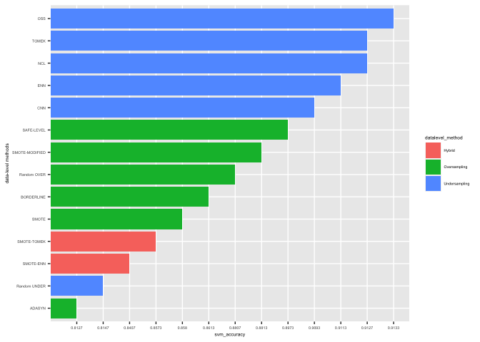

####  1. IMPORT DATASET


```r
library('modeldata')
data("mlc_churn")
glimpse(mlc_churn)
```

```
## Rows: 5,000
## Columns: 20
## $ state                         <fct> KS, OH, NJ, OH, OK, AL, MA, MO, LA, WV, …
## $ account_length                <int> 128, 107, 137, 84, 75, 118, 121, 147, 11…
## $ area_code                     <fct> area_code_415, area_code_415, area_code_…
## $ international_plan            <fct> no, no, no, yes, yes, yes, no, yes, no, …
## $ voice_mail_plan               <fct> yes, yes, no, no, no, no, yes, no, no, y…
## $ number_vmail_messages         <int> 25, 26, 0, 0, 0, 0, 24, 0, 0, 37, 0, 0, …
## $ total_day_minutes             <dbl> 265.1, 161.6, 243.4, 299.4, 166.7, 223.4…
## $ total_day_calls               <int> 110, 123, 114, 71, 113, 98, 88, 79, 97, …
## $ total_day_charge              <dbl> 45.07, 27.47, 41.38, 50.90, 28.34, 37.98…
## $ total_eve_minutes             <dbl> 197.4, 195.5, 121.2, 61.9, 148.3, 220.6,…
## $ total_eve_calls               <int> 99, 103, 110, 88, 122, 101, 108, 94, 80,…
## $ total_eve_charge              <dbl> 16.78, 16.62, 10.30, 5.26, 12.61, 18.75,…
## $ total_night_minutes           <dbl> 244.7, 254.4, 162.6, 196.9, 186.9, 203.9…
## $ total_night_calls             <int> 91, 103, 104, 89, 121, 118, 118, 96, 90,…
## $ total_night_charge            <dbl> 11.01, 11.45, 7.32, 8.86, 8.41, 9.18, 9.…
## $ total_intl_minutes            <dbl> 10.0, 13.7, 12.2, 6.6, 10.1, 6.3, 7.5, 7…
## $ total_intl_calls              <int> 3, 3, 5, 7, 3, 6, 7, 6, 4, 5, 6, 5, 2, 5…
## $ total_intl_charge             <dbl> 2.70, 3.70, 3.29, 1.78, 2.73, 1.70, 2.03…
## $ number_customer_service_calls <int> 1, 1, 0, 2, 3, 0, 3, 0, 1, 0, 4, 0, 1, 3…
## $ churn                         <fct> no, no, no, no, no, no, no, no, no, no, …
```

#### 2. PRE PROCESSING DATA
###### 2.1 CHECKING THE MISSING  VALUE


```r
sum(is.na(mlc_churn))
```

```
## [1] 0
```

###### 2.2 CHECKING THE IMBALANCENESS

```r
table(mlc_churn$churn) 
```

```
## 
##  yes   no 
##  707 4293
```


###### 2.3  ENCODING VARIABLE
We codify the dependent variable in order to make it both binary and factor

```r
churn_new<- mlc_churn %>% mutate(churn = ifelse(churn=='no', 0, 1))  %>% mutate(churn=as.factor(churn))
table(churn_new$churn)
```

```
## 
##    0    1 
## 4293  707
```


#### 3. FEATURE ENGINEERING


```r
churn_balance<-churn_new %>% select (-area_code,-account_length,-international_plan,-voice_mail_plan,-state) %>% mutate(churn=factor(churn))
```

#### 4.  IMBALANCE PRE-PROCESSING METHODS

###### 4.1  SPLITTING TRAIN AND TEST

```r
set.seed(123)
split.churn <- initial_split(churn_balance, 0.7)
train.churn <- training(split.churn)
test.churn <- testing(split.churn)
```


```r
var_y=train.churn$churn
n<-ncol(train.churn)
var_x<-train.churn[,-n]
table(var_y)
```

```
## var_y
##    0    1 
## 3010  490
```

```r
prop.table(table(var_y))
```

```
## var_y
##    0    1 
## 0.86 0.14
```

###### 4.2 LET'S TRY CLASSIFIER WITH UNBALANCED DATA


```r
svm_unbalanced<-svm(churn~.,data=train.churn,kernel='radial')
pred_svm_unbalanced<-predict(svm_unbalanced,test.churn,type='class')
cf_svm_unbalanced<-confusionMatrix(pred_svm_unbalanced,test.churn$churn)
cf_svm_unbalanced
```

```
## Confusion Matrix and Statistics
## 
##           Reference
## Prediction    0    1
##          0 1278  131
##          1    5   86
##                                           
##                Accuracy : 0.9093          
##                  95% CI : (0.8937, 0.9234)
##     No Information Rate : 0.8553          
##     P-Value [Acc > NIR] : 1.843e-10       
##                                           
##                   Kappa : 0.5172          
##                                           
##  Mcnemar's Test P-Value : < 2.2e-16       
##                                           
##             Sensitivity : 0.9961          
##             Specificity : 0.3963          
##          Pos Pred Value : 0.9070          
##          Neg Pred Value : 0.9451          
##              Prevalence : 0.8553          
##          Detection Rate : 0.8520          
##    Detection Prevalence : 0.9393          
##       Balanced Accuracy : 0.6962          
##                                           
##        'Positive' Class : 0               
## 
```

#### 4.3 UNDERSAMPLING METHODS

###### RANDOM UNDERSAMPLING
This method randomly removes instances from majority class.It balanced equally the dataset 


```r
churn_under<-ubBalance(X=var_x,Y=var_y,type='ubUnder',percOver=200,percUnder=200,k=2,perc=50)
method_under<-cbind(churn_under$X,churn_under$Y)
table(method_under$`churn_under$Y`)
```

```
## 
##   0   1 
## 490 490
```

##### CNN
the subset was created by all cases of minority class and random cases from majority classes then it uses NN rule to classify.
This method removes 42 instances (2968-490)


```r
set.seed(789)
churn_cnn_method=ubCNN(X=var_x, Y=var_y,k=2,verbose=F)
method_cnn<-cbind(churn_cnn_method$X,churn_cnn_method$Y)
table(method_cnn$`churn_cnn_method$Y`)
```

```
## 
##    0    1 
## 2968  490
```

##### TOMEK
This method consists in finding a pair of examples is called a ’Tomek link’, if they belong to different classes and are each other’s nearest neighbors. Thus, all the majority class samples that are part of a Tomek link are removed.

This method removes 278 instances ,it works better than CNN (2732-490)

```r
set.seed(451)
churn_tomek<-ubBalance(X=var_x,Y=var_y,type='ubTomek',percOver=100,percUnder=200)
method_tomek<-cbind(churn_tomek$X,churn_tomek$Y)
table(method_tomek$`churn_tomek$Y`)
```

```
## 
##    0    1 
## 2732  490
```

##### OSS
This method proposes a careful removal of cases belonging to the majority class while leaving untouched all cases from the minority class.
This method removes 299 instances (bug:278), it works better than CNN and Tomek(2711-490)


```r
set.seed(781)
churn_oss_method=ubOSS(X=var_x, Y=var_y,verbose = T)
```

```
## Instances removed 278 : 9.3 % of 0 class ; 7.99 % of training ; Time needed 0.01
```

```r
method_oss<-cbind(churn_oss_method$X,churn_oss_method$Y)
table(method_oss$`churn_oss_method$Y`)
```

```
## 
##    0    1 
## 2711  490
```

##### ENN
This method removes any example whose class label differs from the class of at least two of its three nearest neighbors. 
This method removes 15 instances (2995-490)


```r
set.seed(971)
churn_enn_method=ubENN(X=var_x, Y=var_y,k=3,verbose = T)
```

```
## Number of instances removed from majority class with ENN: 15 	 Time needed: 0.3
```

```r
method_enn<-cbind(churn_enn_method$X,churn_enn_method$Y)
table(method_enn$`churn_enn_method$Y`)
```

```
## 
##    0    1 
## 2995  490
```

##### NCL

The procedure consists in selecting all examples from the minority class. Then all of the ambiguous examples in the majority class are identified using the ENN rule and removed. Finally, a one-step version of CNN is used where those remaining examples in the majority class that are misclassified against the store are removed, but only if the number of examples in the majority class is larger than half the size of the minority class.

This method removed 585 instances from majority class, it works better than ENN and CNN


```r
set.seed(654)
churn_ncl_method<-ubNCL(X=var_x, Y=var_y, k = 3, verbose = TRUE)
```

```
## Number of instances removed from majority class with ENN: 15 	 Time needed: 0.29 
## Number of instances removed from majority class after ENN: 570 	 Time needed: 0.06 
## Number of instances removed from majority class: 585
```

```r
method_ncl<-cbind(churn_ncl_method$X,churn_ncl_method$Y)
table(method_ncl$`churn_ncl_method$Y`)
```

```
## 
##    0    1 
## 2425  490
```

#### 4.4 OVERSAMPLING METHODS


###### RANDOM OVERSAMPLING
This method add randomly instances to minority class

```r
churn_over<-ubBalance(X=var_x,Y=var_y,type='ubOver')
method_over<-cbind(churn_over$X,churn_over$Y)
table(method_over$`churn_over$Y`)
```

```
## 
##    0    1 
## 3010 2450
```


##### SMOTE 


```r
churn_smote<-SMOTE(var_x,var_y,K=5,dup_size=0)
method_smote<-churn_smote$data
method_smote_2<- method_smote%>% mutate(churn=as.factor(class)) %>% select(-class)
table(method_smote$class)
```

```
## 
##    0    1 
## 3010 2940
```

##### SMOTE MODIFIED
In this Method we applied a modified Smote,in particular we apply firstly a random undersampling and after the Smote, in this way we boost the accuracy

```r
churn_smote_modif<-ubBalance(X=var_x,Y=var_y,type='ubSMOTE',percOver=220,percUnder=220,k=5,verbose=F)
# per.under triplica la quantità delle minority instances
# perc.over seleziona in modo random la majority class
method_smote_modif<-cbind(churn_smote_modif$X,churn_smote_modif$Y)
table(method_smote_modif$`churn_smote_modif$Y`)
```

```
## 
##    0    1 
## 2156 1470
```


##### ADASYN
This Method works like all oversampling methods becauase it oversample the minority class and leave unchanged the majority class.

```r
churn_adasyn<-ADAS(var_x,var_y,K=3)
method_adasyn<-churn_adasyn$data
method_adasyn_2<- method_adasyn %>% mutate(churn=as.factor(class)) %>% select(-class)
table(method_adasyn$class) 
```

```
## 
##    0    1 
## 3010 3023
```

##### SAFE-LEVEL SMOTE

Safe- Level-SMOTE carefully samples minority instances along the same line with different weight degree, called safe level. The safe level computes by using nearest neighbour minority instances. By synthesizing the minority instances more around larger safe level, we achieve a better accuracy performance than SMOTE and Borderline-SMOTE.


```r
set.seed(437)
churn_safelevel<- SLS(var_x,var_y, K = 5, C = 5, dupSize = 0)
```

```
## [1] "SLS done"
```

```r
method_safelevel<-churn_safelevel$data
method_safelevel_2<- method_safelevel %>% mutate(churn=as.factor(class)) %>% select(-class)
table(method_safelevel$class)
```

```
## 
##    0    1 
## 3010 2140
```


##### BORDELINE SMOTE


I preferred to use the Borderline-Smote 1 and 2 combined rather than divided.
This method balanced 3010-2995

```r
set.seed(734)
churn_blsmote<-BLSMOTE(var_x,var_y,K=5,C=5,dupSize=0,method =c("type1","type2"))
```

```
## [1] "Borderline-SMOTE done"
```

```r
method_blsmote<-churn_blsmote$data
method_blsmote_2<- method_blsmote %>% mutate(churn=as.factor(class)) %>% select(-class)
table(method_blsmote$class)
```

```
## 
##    0    1 
## 3010 2995
```

#### 4.5 HYBRID METHODS


##### SMOTE-ENN

Smote-ENN firstly samples from the original data set with SMOTE and then cleans up the sampled data by removing instances which are misclassified based on ENN.


it balanced 2707 - 2940

```r
set.seed(456)
churn_smote_enn_method=ubENN(X=method_smote_2[,-15], Y=method_smote_2$churn,k=3,verbose = T)
```

```
## Number of instances removed from majority class with ENN: 303 	 Time needed: 0.31
```

```r
method_smote_enn<-cbind(churn_smote_enn_method$X,churn_smote_enn_method$Y)
table(method_smote_enn$`churn_smote_enn_method$Y`)
```

```
## 
##    0    1 
## 2707 2940
```


##### SMOTE-TOMEK
This method firstly oversampled the minority class with Smote and after it reduce the instances of Majority class with Tomek.


```r
set.seed(345)
churn_smote_tomek<-ubBalance(X=method_smote_2[,-15],Y=method_smote_2$churn,type='ubTomek',percOver=100,percUnder=200)
method_smote_tomek<-cbind(churn_smote_tomek$X,churn_smote_tomek$Y)
table(method_smote_tomek$`churn_smote_tomek$Y`)
```

```
## 
##    0    1 
## 2973 2940
```

#### 5 MODEL

##### 5.1 NOW WE TRAIN THE SVM CLASSIFIER

```r
set.seed(897)

#SVM UNDERSAMPLING 
#SVM UNDER
svm_under<-svm(method_under$`churn_under$Y`~ .,data=method_under,kernel='radial')
svm_pred_under <- predict(svm_under,test.churn, type = "class")
cm_svm_under<- confusionMatrix(svm_pred_under, test.churn$churn)


#SVM CNN
svm_cnn<-svm(method_cnn$`churn_cnn_method$Y`~ .,data=method_cnn,kernel='radial')
svm_pred_cnn <- predict(svm_cnn,test.churn, type = "class")
cm_svm_cnn<- confusionMatrix(svm_pred_cnn, test.churn$churn)


#SVM TOMEK
svm_tomek<-svm(method_tomek$`churn_tomek$Y`~ .,data=method_tomek,kernel='radial')
svm_pred_tomek <- predict(svm_tomek,test.churn, type = "class")
cm_svm_tomek<- confusionMatrix(svm_pred_tomek, test.churn$churn)


#SVM OSS
svm_oss<-svm(method_oss$`churn_oss_method$Y`~ .,data=method_oss,kernel='radial')
svm_pred_oss <- predict(svm_oss,test.churn, type = "class")
cm_svm_oss<- confusionMatrix(svm_pred_oss, test.churn$churn)


#SVM ENN
svm_enn<-svm(method_enn$`churn_enn_method$Y`~ .,data=method_enn,kernel='radial')
svm_pred_enn <- predict(svm_enn,test.churn, type = "class")
cm_svm_enn<- confusionMatrix(svm_pred_enn, test.churn$churn)


#SVM NCL
svm_ncl<-svm(method_ncl$`churn_ncl_method$Y`~ .,data=method_ncl,kernel='radial')
svm_pred_ncl <- predict(svm_ncl,test.churn, type = "class")
cm_svm_ncl<- confusionMatrix(svm_pred_ncl, test.churn$churn)


#SVM OVERSAMPLING
#SVM RANDOM OVER
svm_over<-svm(method_over$`churn_over$Y`~ .,data=method_over,kernel='radial')
svm_pred_over <- predict(svm_over,test.churn, type = "class")
cm_svm_over<- confusionMatrix(svm_pred_over, test.churn$churn)
 

#SVM SMOTE
svm_smote<-svm(method_smote_2$churn~ .,data=method_smote_2,kernel='radial')
svm_pred_smote <- predict(svm_smote,test.churn, type = "class")
cm_svm_smote<- confusionMatrix(svm_pred_smote, test.churn$churn)


#SVM SMOTE-MODIFIED 

svm_smote_modified<-svm(method_smote_modif$`churn_smote_modif$Y`~ .,data=method_smote_modif,kernel='radial')
svm_pred_smote_modified <- predict(svm_smote_modified,test.churn, type = "class")
cm_svm_smote_mod<- confusionMatrix(svm_pred_smote_modified, test.churn$churn)


#SVM ADASYN
svm_adasyn<-svm(method_adasyn_2$churn ~.,data=method_adasyn_2,kernel='radial')
svm_pred_adasyn <- predict(svm_adasyn,test.churn, type = "class")
cm_svm_adasyn<- confusionMatrix(svm_pred_adasyn, test.churn$churn)


# SVM SAFE LEVEL SMOTE
svm_safelevel<-svm(method_safelevel_2$churn~.,data=method_safelevel_2,kernel='radial')
svm_pred_safelevel <- predict(svm_safelevel,test.churn, type = "class")
cm_svm_safelevel<- confusionMatrix(svm_pred_safelevel, test.churn$churn)


# SVM BORDERLINE SMOTE
svm_blsmote<-svm(method_blsmote_2$churn~.,data=method_blsmote_2,kernel='radial')
svm_pred_blsmote <- predict(svm_blsmote,test.churn, type = "class")
cm_svm_blsmote<- confusionMatrix(svm_pred_blsmote, test.churn$churn)
  
#SVM HYBRID METHODS

# SVM SMOTE-TOMEK
svm_smote_tomek<-svm(method_smote_tomek$`churn_smote_tomek$Y`~.,data=method_smote_tomek,kernel='radial')
svm_pred_smote_tomek <- predict(svm_smote_tomek,test.churn, type = "class")
cm_svm_smote_tomek<- confusionMatrix(svm_pred_smote_tomek, test.churn$churn)


# SVM SMOTE-ENN
svm_smote_enn<-svm(method_smote_enn$`churn_smote_enn_method$Y`~.,data=method_smote_enn,kernel='radial')
svm_pred_smote_enn <- predict(svm_smote_enn,test.churn, type = "class")
cm_svm_smote_enn<- confusionMatrix(svm_pred_smote_enn, test.churn$churn)
```

##### 5.2 PREPARING DATA FOR THE PLOT

```r
SVM_UNDER<- round(cm_svm_under$overall['Accuracy'],4)
SVM_CNN<-round(cm_svm_cnn$overall['Accuracy'],4)
SVM_TOMEK<-round(cm_svm_tomek$overall['Accuracy'],4)
SVM_OSS<-round(cm_svm_oss$overall['Accuracy'],4)
SVM_ENN<-round(cm_svm_enn$overall['Accuracy'],4)
SVM_NCL<-round(cm_svm_ncl$overall['Accuracy'],4)
SVM_OVER<-round(cm_svm_over$overall['Accuracy'],4)
SVM_SMOTE<-round(cm_svm_smote$overall['Accuracy'],4)
SVM_SMOTE_MOD<-round(cm_svm_smote_mod$overall['Accuracy'],4)
SVM_ADASYN<-round(cm_svm_adasyn$overall['Accuracy'],4)
SVM_SAFELEVEL<-round(cm_svm_safelevel$overall['Accuracy'],4)
SVM_BORDERLINE<- round(cm_svm_blsmote$overall['Accuracy'],4)
SVM_SMOTE_ENN<- round(cm_svm_smote_enn$overall['Accuracy'],4)
SVM_SMOTE_TOMEK<- round(cm_svm_smote_tomek$overall['Accuracy'],4)
svm_accuracy<-c(SVM_UNDER,SVM_CNN,SVM_TOMEK,SVM_OSS,SVM_ENN,SVM_NCL,SVM_OVER,SVM_SMOTE,SVM_SMOTE_MOD,SVM_ADASYN,SVM_SAFELEVEL,SVM_BORDERLINE,SVM_SMOTE_ENN,SVM_SMOTE_TOMEK)

imbalance_method<-c('Random UNDER','CNN','TOMEK','OSS','ENN','NCL','Random OVER','SMOTE','SMOTE-MODIFIED','ADASYN',
             'SAFE-LEVEL','BORDERLINE','SMOTE-ENN','SMOTE-TOMEK')
df_data<-cbind(svm_accuracy,imbalance_method)
df_data<-as.tibble(df_data)
```

```
## Warning: `as.tibble()` was deprecated in tibble 2.0.0.
## Please use `as_tibble()` instead.
## The signature and semantics have changed, see `?as_tibble`.
## This warning is displayed once every 8 hours.
## Call `lifecycle::last_warnings()` to see where this warning was generated.
```

```r
datalevel_method<-c('Undersampling','Undersampling','Undersampling','Undersampling','Undersampling','Undersampling','Oversampling','Oversampling','Oversampling','Oversampling','Oversampling','Oversampling','Hybrid',
               'Hybrid')
df_data2<- cbind(df_data,datalevel_method)
```

##### 5.3 PLOT OF ACCURACY


```r
df_data2 %>% ggplot(aes(x=reorder(imbalance_method,-desc(svm_accuracy)),y=svm_accuracy,fill=datalevel_method))+ geom_col() + 
    theme(text = element_text(size=5)) + coord_flip()+
  labs( x='data-level methods')
```

<!-- -->


