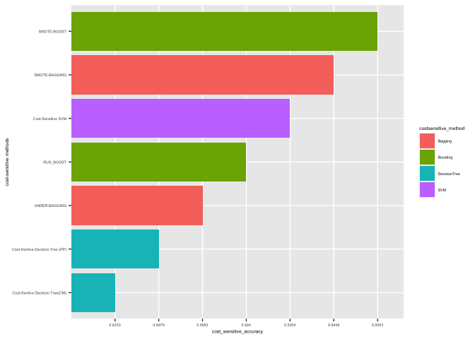

####  1. IMPORT DATASET

```r
data(spam)
glimpse(spam)
```

```
## Rows: 4,601
## Columns: 58
## $ make              <dbl> 0.00, 0.21, 0.06, 0.00, 0.00, 0.00, 0.00, 0.00, 0.15…
## $ address           <dbl> 0.64, 0.28, 0.00, 0.00, 0.00, 0.00, 0.00, 0.00, 0.00…
## $ all               <dbl> 0.64, 0.50, 0.71, 0.00, 0.00, 0.00, 0.00, 0.00, 0.46…
## $ num3d             <dbl> 0, 0, 0, 0, 0, 0, 0, 0, 0, 0, 0, 0, 0, 0, 0, 0, 0, 0…
## $ our               <dbl> 0.32, 0.14, 1.23, 0.63, 0.63, 1.85, 1.92, 1.88, 0.61…
## $ over              <dbl> 0.00, 0.28, 0.19, 0.00, 0.00, 0.00, 0.00, 0.00, 0.00…
## $ remove            <dbl> 0.00, 0.21, 0.19, 0.31, 0.31, 0.00, 0.00, 0.00, 0.30…
## $ internet          <dbl> 0.00, 0.07, 0.12, 0.63, 0.63, 1.85, 0.00, 1.88, 0.00…
## $ order             <dbl> 0.00, 0.00, 0.64, 0.31, 0.31, 0.00, 0.00, 0.00, 0.92…
## $ mail              <dbl> 0.00, 0.94, 0.25, 0.63, 0.63, 0.00, 0.64, 0.00, 0.76…
## $ receive           <dbl> 0.00, 0.21, 0.38, 0.31, 0.31, 0.00, 0.96, 0.00, 0.76…
## $ will              <dbl> 0.64, 0.79, 0.45, 0.31, 0.31, 0.00, 1.28, 0.00, 0.92…
## $ people            <dbl> 0.00, 0.65, 0.12, 0.31, 0.31, 0.00, 0.00, 0.00, 0.00…
## $ report            <dbl> 0.00, 0.21, 0.00, 0.00, 0.00, 0.00, 0.00, 0.00, 0.00…
## $ addresses         <dbl> 0.00, 0.14, 1.75, 0.00, 0.00, 0.00, 0.00, 0.00, 0.00…
## $ free              <dbl> 0.32, 0.14, 0.06, 0.31, 0.31, 0.00, 0.96, 0.00, 0.00…
## $ business          <dbl> 0.00, 0.07, 0.06, 0.00, 0.00, 0.00, 0.00, 0.00, 0.00…
## $ email             <dbl> 1.29, 0.28, 1.03, 0.00, 0.00, 0.00, 0.32, 0.00, 0.15…
## $ you               <dbl> 1.93, 3.47, 1.36, 3.18, 3.18, 0.00, 3.85, 0.00, 1.23…
## $ credit            <dbl> 0.00, 0.00, 0.32, 0.00, 0.00, 0.00, 0.00, 0.00, 3.53…
## $ your              <dbl> 0.96, 1.59, 0.51, 0.31, 0.31, 0.00, 0.64, 0.00, 2.00…
## $ font              <dbl> 0, 0, 0, 0, 0, 0, 0, 0, 0, 0, 0, 0, 0, 0, 0, 0, 0, 0…
## $ num000            <dbl> 0.00, 0.43, 1.16, 0.00, 0.00, 0.00, 0.00, 0.00, 0.00…
## $ money             <dbl> 0.00, 0.43, 0.06, 0.00, 0.00, 0.00, 0.00, 0.00, 0.15…
## $ hp                <dbl> 0, 0, 0, 0, 0, 0, 0, 0, 0, 0, 0, 0, 0, 0, 0, 0, 0, 0…
## $ hpl               <dbl> 0, 0, 0, 0, 0, 0, 0, 0, 0, 0, 0, 0, 0, 0, 0, 0, 0, 0…
## $ george            <dbl> 0, 0, 0, 0, 0, 0, 0, 0, 0, 0, 0, 0, 0, 0, 0, 0, 0, 0…
## $ num650            <dbl> 0.00, 0.00, 0.00, 0.00, 0.00, 0.00, 0.00, 0.00, 0.00…
## $ lab               <dbl> 0, 0, 0, 0, 0, 0, 0, 0, 0, 0, 0, 0, 0, 0, 0, 0, 0, 0…
## $ labs              <dbl> 0, 0, 0, 0, 0, 0, 0, 0, 0, 0, 0, 0, 0, 0, 0, 0, 0, 0…
## $ telnet            <dbl> 0, 0, 0, 0, 0, 0, 0, 0, 0, 0, 0, 0, 0, 0, 0, 0, 0, 0…
## $ num857            <dbl> 0, 0, 0, 0, 0, 0, 0, 0, 0, 0, 0, 0, 0, 0, 0, 0, 0, 0…
## $ data              <dbl> 0.00, 0.00, 0.00, 0.00, 0.00, 0.00, 0.00, 0.00, 0.15…
## $ num415            <dbl> 0, 0, 0, 0, 0, 0, 0, 0, 0, 0, 0, 0, 0, 0, 0, 0, 0, 0…
## $ num85             <dbl> 0, 0, 0, 0, 0, 0, 0, 0, 0, 0, 0, 0, 0, 0, 0, 0, 0, 0…
## $ technology        <dbl> 0.00, 0.00, 0.00, 0.00, 0.00, 0.00, 0.00, 0.00, 0.00…
## $ num1999           <dbl> 0.00, 0.07, 0.00, 0.00, 0.00, 0.00, 0.00, 0.00, 0.00…
## $ parts             <dbl> 0, 0, 0, 0, 0, 0, 0, 0, 0, 0, 0, 0, 0, 0, 0, 0, 0, 0…
## $ pm                <dbl> 0, 0, 0, 0, 0, 0, 0, 0, 0, 0, 0, 0, 0, 0, 0, 0, 0, 0…
## $ direct            <dbl> 0.00, 0.00, 0.06, 0.00, 0.00, 0.00, 0.00, 0.00, 0.00…
## $ cs                <dbl> 0, 0, 0, 0, 0, 0, 0, 0, 0, 0, 0, 0, 0, 0, 0, 0, 0, 0…
## $ meeting           <dbl> 0, 0, 0, 0, 0, 0, 0, 0, 0, 0, 0, 0, 0, 0, 0, 0, 0, 0…
## $ original          <dbl> 0.00, 0.00, 0.12, 0.00, 0.00, 0.00, 0.00, 0.00, 0.30…
## $ project           <dbl> 0.00, 0.00, 0.00, 0.00, 0.00, 0.00, 0.00, 0.00, 0.00…
## $ re                <dbl> 0.00, 0.00, 0.06, 0.00, 0.00, 0.00, 0.00, 0.00, 0.00…
## $ edu               <dbl> 0.00, 0.00, 0.06, 0.00, 0.00, 0.00, 0.00, 0.00, 0.00…
## $ table             <dbl> 0, 0, 0, 0, 0, 0, 0, 0, 0, 0, 0, 0, 0, 0, 0, 0, 0, 0…
## $ conference        <dbl> 0, 0, 0, 0, 0, 0, 0, 0, 0, 0, 0, 0, 0, 0, 0, 0, 0, 0…
## $ charSemicolon     <dbl> 0.000, 0.000, 0.010, 0.000, 0.000, 0.000, 0.000, 0.0…
## $ charRoundbracket  <dbl> 0.000, 0.132, 0.143, 0.137, 0.135, 0.223, 0.054, 0.2…
## $ charSquarebracket <dbl> 0.000, 0.000, 0.000, 0.000, 0.000, 0.000, 0.000, 0.0…
## $ charExclamation   <dbl> 0.778, 0.372, 0.276, 0.137, 0.135, 0.000, 0.164, 0.0…
## $ charDollar        <dbl> 0.000, 0.180, 0.184, 0.000, 0.000, 0.000, 0.054, 0.0…
## $ charHash          <dbl> 0.000, 0.048, 0.010, 0.000, 0.000, 0.000, 0.000, 0.0…
## $ capitalAve        <dbl> 3.756, 5.114, 9.821, 3.537, 3.537, 3.000, 1.671, 2.4…
## $ capitalLong       <dbl> 61, 101, 485, 40, 40, 15, 4, 11, 445, 43, 6, 11, 61,…
## $ capitalTotal      <dbl> 278, 1028, 2259, 191, 191, 54, 112, 49, 1257, 749, 2…
## $ type              <fct> spam, spam, spam, spam, spam, spam, spam, spam, spam…
```

#### 2. PRE PROCESSING DATA
##### 2.2 CHECKING THE IMBALANCENESS

```r
prop.table(table(spam$type))
```

```
## 
##   nonspam      spam 
## 0.6059552 0.3940448
```

```r
table(spam$type)
```

```
## 
## nonspam    spam 
##    2788    1813
```


##### 2.3 MAKE THE DATASET UNBALANCED

```r
spam_1<-spam[1400:4601,]
prop.table(table(spam_1$type))
```

```
## 
##   nonspam      spam 
## 0.8707058 0.1292942
```

```r
table(spam_1$type)
```

```
## 
## nonspam    spam 
##    2788     414
```

##### 2.4  SPLITTING TRAIN AND TEST


```r
set.seed(234)
spam.split<-initial_split(spam_1,0.7)
spam.train<-training(spam.split)
spam.test<-testing(spam.split)
table(spam.train$type)
```

```
## 
## nonspam    spam 
##    1951     291
```

#### 3. MODEL
###### LET'S TRY SVM WITH UNBALANCED DATA


```r
set.seed(978)
svm_spam_unbalance<-svm(type~.,data=spam.train,kernel='radial')
svm.pred_unbalance<-predict(svm_spam_unbalance,spam.test,type='class')
cm_spam_unbalance<-confusionMatrix(svm.pred_unbalance,spam.test$type)
cm_spam_unbalance 
```

```
## Confusion Matrix and Statistics
## 
##           Reference
## Prediction nonspam spam
##    nonspam     832   44
##    spam          5   79
##                                          
##                Accuracy : 0.949          
##                  95% CI : (0.9331, 0.962)
##     No Information Rate : 0.8719         
##     P-Value [Acc > NIR] : 1.068e-15      
##                                          
##                   Kappa : 0.7358         
##                                          
##  Mcnemar's Test P-Value : 5.681e-08      
##                                          
##             Sensitivity : 0.9940         
##             Specificity : 0.6423         
##          Pos Pred Value : 0.9498         
##          Neg Pred Value : 0.9405         
##              Prevalence : 0.8719         
##          Detection Rate : 0.8667         
##    Detection Prevalence : 0.9125         
##       Balanced Accuracy : 0.8182         
##                                          
##        'Positive' Class : nonspam        
## 
```


##### 3.1 COST-SENSITIVE SVM


```r
weight<-table(spam.train$type)
weight[1]<-1
weight[2]<-10

svm_spam<-svm(type~.,data=spam.train,kernel='radial',class.weights=weight)
svm.pred<-predict(svm_spam,spam.test,type='class')
cm_spam<-confusionMatrix(svm.pred,spam.test$type)
cm_spam
```

```
## Confusion Matrix and Statistics
## 
##           Reference
## Prediction nonspam spam
##    nonspam     798   23
##    spam         39  100
##                                          
##                Accuracy : 0.9354         
##                  95% CI : (0.918, 0.9501)
##     No Information Rate : 0.8719         
##     P-Value [Acc > NIR] : 9.987e-11      
##                                          
##                   Kappa : 0.7261         
##                                          
##  Mcnemar's Test P-Value : 0.05678        
##                                          
##             Sensitivity : 0.9534         
##             Specificity : 0.8130         
##          Pos Pred Value : 0.9720         
##          Neg Pred Value : 0.7194         
##              Prevalence : 0.8719         
##          Detection Rate : 0.8313         
##    Detection Prevalence : 0.8552         
##       Balanced Accuracy : 0.8832         
##                                          
##        'Positive' Class : nonspam        
## 
```


###### LET'S TRY DECISION TREE WITH UNBALANCED DATA

```r
spam_model<-rpart(type~.,data=spam.train,method='class',parms = list(split = "gini"))
spam_prediction<-predict(object = spam_model,newdata =spam.test,type='class')
confusionMatrix(data = spam_prediction,       
                reference = spam.test$type) 
```

```
## Confusion Matrix and Statistics
## 
##           Reference
## Prediction nonspam spam
##    nonspam     814   33
##    spam         23   90
##                                           
##                Accuracy : 0.9417          
##                  95% CI : (0.9249, 0.9556)
##     No Information Rate : 0.8719          
##     P-Value [Acc > NIR] : 7.519e-13       
##                                           
##                   Kappa : 0.7295          
##                                           
##  Mcnemar's Test P-Value : 0.2291          
##                                           
##             Sensitivity : 0.9725          
##             Specificity : 0.7317          
##          Pos Pred Value : 0.9610          
##          Neg Pred Value : 0.7965          
##              Prevalence : 0.8719          
##          Detection Rate : 0.8479          
##    Detection Prevalence : 0.8823          
##       Balanced Accuracy : 0.8521          
##                                           
##        'Positive' Class : nonspam         
## 
```


##### 3.2 COST-SENSITIVE DECISION TREE

##### 1. Adjusting Prior Probabilities
Prior probability is the proportion of events and non-events in the imbalance classes.Using more balanced priors or a balanced training set may help deal with a class imbalance.
In CART, you can specify prior probability assigned to each class to adjust the importance of misclassifications for each class.


```r
spam_dt<- rpart(type~.,data=spam.train,method='class', parms=list(prior=c(.5,.5)))
#parms=optional parameters for the splitting function.
spam_pred_dt<-predict(object = spam_dt,newdata =spam.test,type='class')
cm_dt_pp<-confusionMatrix(data = spam_pred_dt,       
                reference = spam.test$type) 

cm_dt_pp
```

```
## Confusion Matrix and Statistics
## 
##           Reference
## Prediction nonspam spam
##    nonspam     753   14
##    spam         84  109
##                                          
##                Accuracy : 0.8979         
##                  95% CI : (0.877, 0.9163)
##     No Information Rate : 0.8719         
##     P-Value [Acc > NIR] : 0.007614       
##                                          
##                   Kappa : 0.6323         
##                                          
##  Mcnemar's Test P-Value : 3.168e-12      
##                                          
##             Sensitivity : 0.8996         
##             Specificity : 0.8862         
##          Pos Pred Value : 0.9817         
##          Neg Pred Value : 0.5648         
##              Prevalence : 0.8719         
##          Detection Rate : 0.7844         
##    Detection Prevalence : 0.7990         
##       Balanced Accuracy : 0.8929         
##                                          
##        'Positive' Class : nonspam        
## 
```

##### 2. Cost Sensitive Training / Loss Learning
A cost matrix  Weights specified must be greater than or equal to zero. The default weight is 1. The cost matrix diagonal must be zero.

In cost-sensitive training, we assign no cost to correct classifications (Cost(TP) and Cost(TN). In other words, cost(TP) and cost(TN) are set to 0. We assign higher cost to FALSE NEGATIVE (actual event predicted as non-event) than FALSE POSITIVE as prediction to event is our objective.

The cost of misclassifying a positive example as a negative observation (FN) as 20 units and cost of misclassifying a negative example as positive (FP) as 1 unit.


```r
loss <- matrix(c(0, 20, 1, 0), ncol=2)
spam_cs<-rpart(type~.,data=spam.train,method='class',parms =list(loss=loss) )
spam_pred_cs<-predict(object = spam_cs,newdata =spam.test,type='class')
cm_dt_mc<-confusionMatrix(data = spam_pred_cs,       
                reference = spam.test$type) 
cm_dt_mc
```

```
## Confusion Matrix and Statistics
## 
##           Reference
## Prediction nonspam spam
##    nonspam     682    5
##    spam        155  118
##                                           
##                Accuracy : 0.8333          
##                  95% CI : (0.8082, 0.8564)
##     No Information Rate : 0.8719          
##     P-Value [Acc > NIR] : 0.9998          
##                                           
##                   Kappa : 0.5093          
##                                           
##  Mcnemar's Test P-Value : <2e-16          
##                                           
##             Sensitivity : 0.8148          
##             Specificity : 0.9593          
##          Pos Pred Value : 0.9927          
##          Neg Pred Value : 0.4322          
##              Prevalence : 0.8719          
##          Detection Rate : 0.7104          
##    Detection Prevalence : 0.7156          
##       Balanced Accuracy : 0.8871          
##                                           
##        'Positive' Class : nonspam         
## 
```


##### 3.3 COST-SENSTIVE ENSAMBLE METHODS

For Ensamble method we need to change the dependent variable in a binary and factorial variable

```r
spam_train2<-spam.train %>% mutate(type = ifelse(type=='nonspam', 0, 1)) %>% mutate(type=as.factor(type))
spam_test2<-spam.test %>% mutate(type = ifelse(type=='nonspam', 0, 1)) %>% mutate(type=as.factor(type))
```


##### 3.3.1 UNDER-BAGGING
In this ensamble methods we have to specify : \
1. the Ensemble size, i.e. number of weak learners in the ensemble model \
2. Alg that train the weak learners(minority class)

```r
under_bag<-ub(type~.,data=spam_train2,size=10,alg='svm')
pred_under_bag<-predict(under_bag,spam_test2,type='class')
cm_underbag<-confusionMatrix(data=pred_under_bag,reference=spam_test2$type)
cm_underbag
```

```
## Confusion Matrix and Statistics
## 
##           Reference
## Prediction   0   1
##          0 765  16
##          1  72 107
##                                           
##                Accuracy : 0.9083          
##                  95% CI : (0.8883, 0.9258)
##     No Information Rate : 0.8719          
##     P-Value [Acc > NIR] : 0.0002592       
##                                           
##                   Kappa : 0.6564          
##                                           
##  Mcnemar's Test P-Value : 4.545e-09       
##                                           
##             Sensitivity : 0.9140          
##             Specificity : 0.8699          
##          Pos Pred Value : 0.9795          
##          Neg Pred Value : 0.5978          
##              Prevalence : 0.8719          
##          Detection Rate : 0.7969          
##    Detection Prevalence : 0.8135          
##       Balanced Accuracy : 0.8919          
##                                           
##        'Positive' Class : 0               
## 
```

##### 3.3.2 SMOTE-BAGGING

```r
smote_bagging<-sbag(type~.,data=spam_train2,size=10,alg='svm')
pred_smote_bagging<-predict(smote_bagging,spam_test2,type='class')
cm_smotebag<-confusionMatrix(data=pred_smote_bagging,reference=spam_test2$type)
cm_smotebag
```

```
## Confusion Matrix and Statistics
## 
##           Reference
## Prediction   0   1
##          0 806  22
##          1  31 101
##                                           
##                Accuracy : 0.9448          
##                  95% CI : (0.9284, 0.9584)
##     No Information Rate : 0.8719          
##     P-Value [Acc > NIR] : 5.096e-14       
##                                           
##                   Kappa : 0.7604          
##                                           
##  Mcnemar's Test P-Value : 0.2718          
##                                           
##             Sensitivity : 0.9630          
##             Specificity : 0.8211          
##          Pos Pred Value : 0.9734          
##          Neg Pred Value : 0.7652          
##              Prevalence : 0.8719          
##          Detection Rate : 0.8396          
##    Detection Prevalence : 0.8625          
##       Balanced Accuracy : 0.8921          
##                                           
##        'Positive' Class : 0               
## 
```


##### 3.3.3 RUS-BOOST


```r
rus_boost<-rus(type~.,data=spam_train2,size=10,alg='svm')
pred_rus_boost<-predict(rus_boost,spam_test2,type='class')
cm_rusboost<-confusionMatrix(pred_rus_boost,spam_test2$type)
cm_rusboost
```

```
## Confusion Matrix and Statistics
## 
##           Reference
## Prediction   0   1
##          0 777  13
##          1  60 110
##                                           
##                Accuracy : 0.924           
##                  95% CI : (0.9053, 0.9399)
##     No Information Rate : 0.8719          
##     P-Value [Acc > NIR] : 1.668e-07       
##                                           
##                   Kappa : 0.7073          
##                                           
##  Mcnemar's Test P-Value : 7.289e-08       
##                                           
##             Sensitivity : 0.9283          
##             Specificity : 0.8943          
##          Pos Pred Value : 0.9835          
##          Neg Pred Value : 0.6471          
##              Prevalence : 0.8719          
##          Detection Rate : 0.8094          
##    Detection Prevalence : 0.8229          
##       Balanced Accuracy : 0.9113          
##                                           
##        'Positive' Class : 0               
## 
```

##### 3.3.4 SMOTE BOOST

```r
smote_boost<-sbo(type~.,data=spam_train2,size=10,alg='svm')
pred_smote_boost<-predict(smote_boost,spam_test2,type='class')
cm_smoteboost<-confusionMatrix(pred_smote_boost,spam_test2$type)
cm_smoteboost
```

```
## Confusion Matrix and Statistics
## 
##           Reference
## Prediction   0   1
##          0 821  24
##          1  16  99
##                                           
##                Accuracy : 0.9583          
##                  95% CI : (0.9437, 0.9701)
##     No Information Rate : 0.8719          
##     P-Value [Acc > NIR] : <2e-16          
##                                           
##                   Kappa : 0.8082          
##                                           
##  Mcnemar's Test P-Value : 0.2684          
##                                           
##             Sensitivity : 0.9809          
##             Specificity : 0.8049          
##          Pos Pred Value : 0.9716          
##          Neg Pred Value : 0.8609          
##              Prevalence : 0.8719          
##          Detection Rate : 0.8552          
##    Detection Prevalence : 0.8802          
##       Balanced Accuracy : 0.8929          
##                                           
##        'Positive' Class : 0               
## 
```

$PREPARING \ DATA\ FOR\ PLOT$


```r
CS_SVM<-round(cm_spam$overall['Accuracy'],4)
CS_DT_PP<-round(cm_dt_pp$overall['Accuracy'],4)
CS_DT_CM<-round(cm_dt_mc$overall['Accuracy'],4)
UNDER_BAGGING<-round(cm_underbag$overall['Accuracy'],4)
SMOTE_BAGGING<-round(cm_smotebag$overall['Accuracy'],4)
RUS_BOOST<-round(cm_rusboost$overall['Accuracy'],4)
SMOTE_BOOST<-round(cm_smoteboost$overall['Accuracy'],4)

cost_sensitive_accuracy<-c(CS_SVM,CS_DT_PP,CS_DT_CM,UNDER_BAGGING,SMOTE_BAGGING,RUS_BOOST,SMOTE_BOOST)
cost_sensitive_method<-c('Cost-Sensitive SVM','Cost-Sentive Decision Tree (PP)','Cost-Sentive Decision Tree(CM)','UNDER-BAGGING','SMOTE-BAGGING','RUS_BOOST','SMOTE-BOOST')
costsensitive_method<-c('SVM','DecisionTree','DecisionTree','Bagging','Bagging','Boosting','Boosting')
df_spam<-cbind(cost_sensitive_accuracy,cost_sensitive_method,costsensitive_method)
df_spam_2<-as.tibble(df_spam)
```

##### 4 PLOT OF ACCURACY


```r
df_spam_2 %>% ggplot(aes(x=reorder(cost_sensitive_method,-desc(cost_sensitive_accuracy)),y=cost_sensitive_accuracy,fill=costsensitive_method))+ geom_col() + 
    theme(text = element_text(size=5)) + coord_flip()+
  labs( x='cost-sensitive methods')
```

<!-- -->


